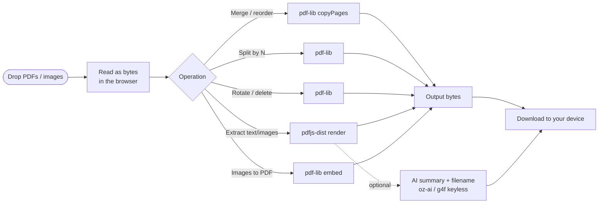

# oriz PDF

> A free PDF toolkit that runs entirely in your browser — merge, split, rotate, reorder, delete, extract text/images, and turn images into a PDF. No upload, no signup.

[](./LICENSE)
[](https://github.com/chirag127/oriz-pdf/stargazers)
[](https://github.com/chirag127/oriz-pdf/commits/main)
[](https://github.com/chirag127/oriz-pdf/actions/workflows/deploy.yml)
[](https://astro.build)

## What it is / why it exists

Most "free PDF" sites upload your document to a server you don't control, gate the useful bits behind a paywall, or bury the tool in ads. That's a real privacy problem for anything remotely sensitive — contracts, statements, scans. **oriz PDF** does every operation in your browser: your files never leave your device. It's the everyday PDF workbench (merge / split / rotate / reorder / extract) with zero backend and nothing to sign up for.

## Links

- **Live app:** https://pdf.oriz.in
- **Info / landing page:** https://chirag127.github.io/oriz-pdf/
- **Repo:** https://github.com/chirag127/oriz-pdf
- **llms.txt:** https://pdf.oriz.in/llms.txt

⭐ If this is useful, please **star the repo** — it helps others find it.

## How it works



Nothing is uploaded. `pdf-lib` and `pdfjs-dist` are lazy-loaded only when you use a feature, so the initial page stays light. The AI step is optional polish; if every provider is down, the core tools still work.

## Features

- **Merge + reorder** — drop multiple PDFs, drag page cards to reorder across files, export one merged PDF.
- **Split** — one document per chunk of N pages (N=1 → one PDF per page), downloaded as a batch.
- **Rotate** — per-page rotation (multiples of 90°), baked into the output.
- **Extract / delete pages** — keep or drop any pages; your selection is the output.
- **Extract text** — text per page as `.txt`; optional AI summary + suggested filename.
- **Extract images** — pull embedded raster images out as PNG.
- **Images → PDF** — drop PNG/JPG, get a page-per-image PDF sized to each image.
- **Page-range parser** — accepts specs like `1-3,5,8-` for selective operations.
- **No upload, no signup, no analytics, free** — everything runs in-browser.

## Tech stack

- **[Astro](https://astro.build)** (static) — zero-JS-by-default shell
- **React 19** islands for the interactive workbench
- **Tailwind CSS v4** via `@tailwindcss/vite`
- **[pdf-lib](https://pdf-lib.js.org/)** — create / merge / split / rotate / embed (all in-browser)
- **[pdfjs-dist](https://mozilla.github.io/pdf.js/)** — render, text extraction, image extraction
- **[@vite-pwa/astro](https://github.com/vite-pwa/astro)** — installable, offline-capable PWA
- **Shared `@chirag127/*` packages** — `oz-ai` (keyless client-side AI over g4f/gpt4free with multi-provider failover, no API key), `oz-chrome` (header/footer shell), `oz-file`, `oz-tokens-base`
- **Fonts:** JetBrains Mono + Space Grotesk (variable, self-hosted via Fontsource)

## Repo structure

```
oriz-pdf/
├── src/
│   ├── components/
│   │   └── Workbench.tsx      # React island — the drafting-table UI
│   ├── lib/
│   │   ├── pdf.ts             # pdf-lib ops: merge/split/rotate/extract/images→pdf
│   │   ├── render.ts          # pdfjs-dist render + text/image extraction
│   │   ├── util.ts            # helpers
│   │   ├── pdf.test.ts        # vitest
│   │   └── util.test.ts
│   ├── layouts/Base.astro
│   ├── pages/index.astro
│   └── styles/                # global.css, workbench.css
├── public/                    # favicon, icons, screenshots, llms.txt, robots.txt
├── gh-info/                   # GitHub Pages info/landing page source
├── astro.config.mjs           # site + PWA manifest
├── PWABUILDER.md              # Android/store packaging notes
└── .github/workflows/         # deploy.yml, gh-pages-info.yml
```

## Quick start

```bash
npm install          # Windows: append --legacy-peer-deps (pnpm skips @esbuild/win32-x64)
npm run dev          # local dev server
npm run build        # static build → dist/
npm test             # vitest — pure PDF/util logic
npm run deploy       # astro build && wrangler pages deploy (Cloudflare Pages)
```

## Configuration

**No configuration required.** This is a fully client-side tool. The optional AI summary works keyless via `@chirag127/oz-ai` (g4f multi-provider failover) — no API keys are needed or committed.

## PWA

oriz PDF is an installable PWA (`@vite-pwa/astro`) and works offline after first load. It can be packaged for the Play Store / app stores via [PWABuilder](https://www.pwabuilder.com) — see [`PWABUILDER.md`](./PWABUILDER.md).

## Screenshots

_Desktop and mobile screenshots live in [`public/screenshots/`](./public/screenshots/) and are wired into the PWA manifest._

## Part of the oriz family

oriz PDF is one of ~80 small, fast, client-side tools in the **oriz** family. See how the fleet is built and why at **https://blog.oriz.in**.

## Cost

**$0 on the Cloudflare free tier** — static hosting, no backend, no database.

## Contributing

Issues and PRs welcome. Keep every operation client-side and lazy-load heavy libraries. Tests live alongside the source (`*.test.ts`) and run with `npm test`.

## License

[MIT](./LICENSE) © Chirag Singhal

## Author

Chirag Singhal · chirag@oriz.in

## Status & roadmap

Stable and in active use. Ideas: PDF compression, page-level watermark, form-field flattening.

## Changelog

Conventional commits are the changelog.
